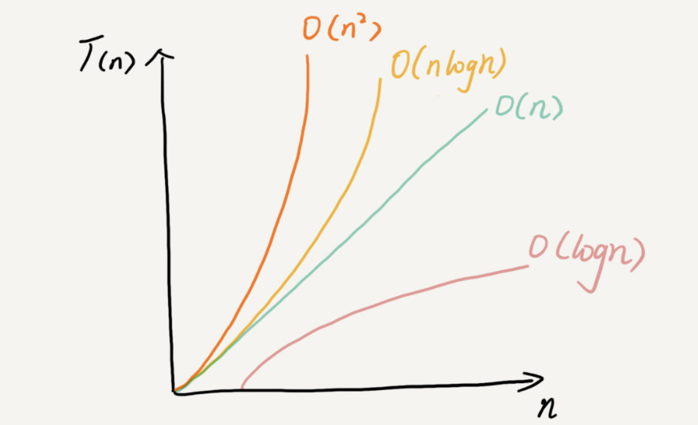

# -

复杂度分析是时间复杂度和空间复杂度的统称，描述的是算法执行时间(或占用空间)与数据规模的增长关系。和性能的基准测试相比。复杂度分析不依赖执行环境、成本低、效率高、指导性强。

[性能的基准测试]又称事后统计法：跑代码，通过统计、监控，得到算法执行的时间和占用的内存大小。得到的实验结果，受环境、数据规模大小因素影响较大。

## 大O表示法

如何进行复杂度分析？

算法的执行时间与每行代码的执行次数成正比，用T(n) = O(f(n)) 表示。（其中T(n) 表示算法执行总时间，f(n) 表示每行代码执行总次数，而n往往表示的是数据规模）。
```
分析法则：
  1. 只关注循环执行次数最多的一段代码
  2. 若嵌套则相乘
  3. 若不同且规模不一则相加
```

## 复杂度分析

常用的复杂度级别：

* 多项式阶：
<br>随着数据规模的增长，算法的执行时间和空间占用，按照多项式的比例增长。包含有常数阶[O(1)]、对数阶[O(logn)]、线性阶[O(n)]、线性对数阶[O(nlogn)]、平方阶[O(n^2^)]、立方阶[O(n^3^)]、……
<br>多项式阶的复杂度快慢可参考下图：<br>

* 非多项式阶：
<br>随着数据规模的增长，算法的执行时间和空间占用暴增，性能极差。包含有指数阶[O(2^n^)]、阶乘阶[O(n!)]
<br>[NP问题] 时间复杂度为非多项式量级的算法问题

几种分析方法：

* 最好情况时间复杂度（ best case time complexity ）：在最理想的情况下，执行代码的时间复杂度。
* 最坏情况时间复杂度（ worst case time complexity ）：在最糟糕的情况下，执行代码的时间复杂度。
* 平均情况时间复杂度（ average case time complexity ）：即概率论中的加权平均值，也称期望值。<br>所以平均时间复杂度 = 加权平均时间复杂度 = 期望平均时间复杂度
* 均摊时间复杂度（ amortised case time complexity ）：摊还分析法（平摊分析）。<br>
例子：每一次 O(n) 的插入操作，都会跟着 n-1 次 O(1)的插入操作，所以把耗时多的那次操作均摊到接下来的 n-1 次耗时少的操作上，均摊下来，这一组连续的操作的均摊时间复杂度就是 O(1)。
<br>一般，低级别和高级别复杂度出现具有时序规律。均摊结果一般都等于低级别复杂度。

<br>

[>> 返回主目录](../README.md)