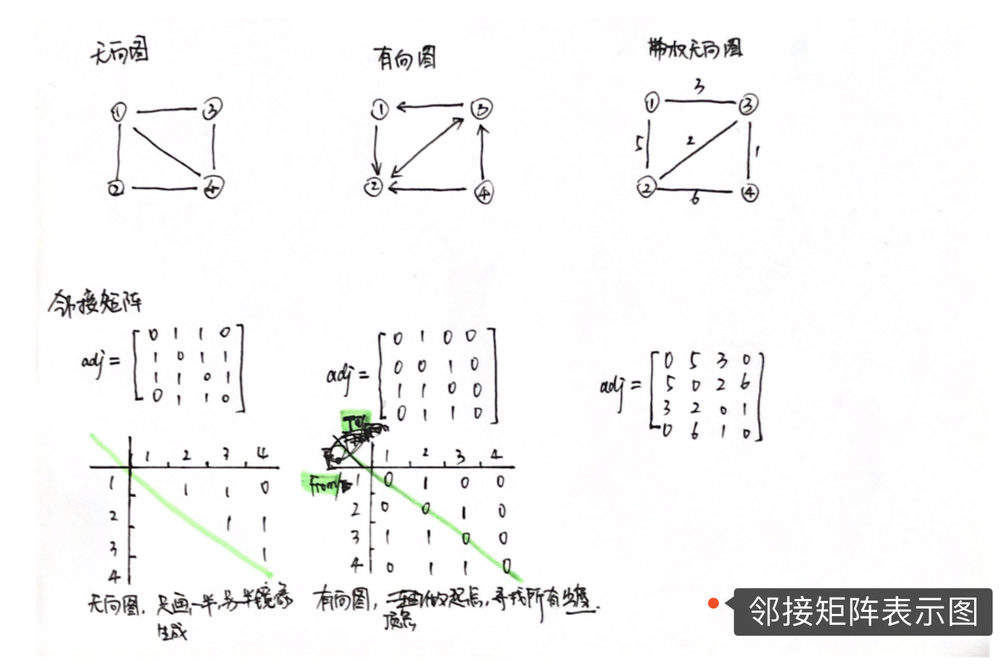
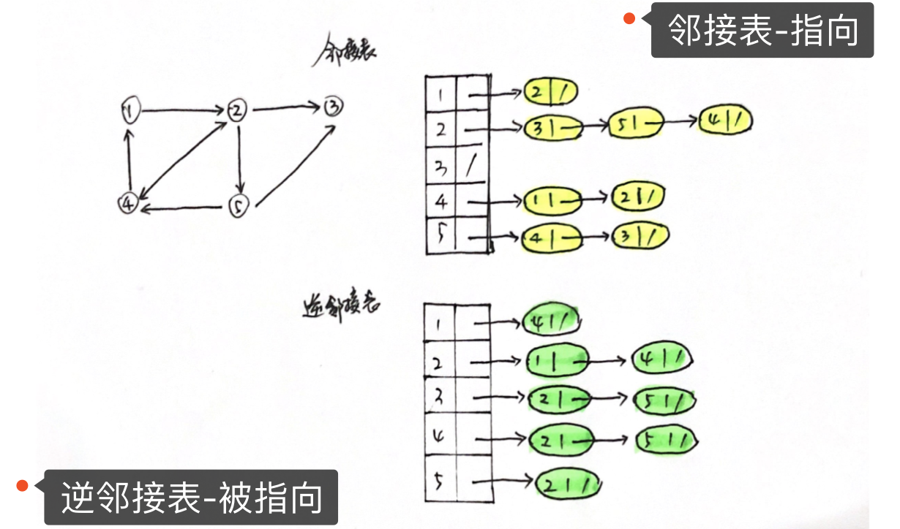

# 图

## 概念

图， 非线性表数据结构之一。

图分有向图、无向图、带权无向图...
```text
顶点（ vertex ）：图中的元素
边（ edge ）：顶点与顶点之间的关系

无向图 -> 度（ degree ）：每个顶点连接的边数
有向图 -> 入度（ In-degree ）、出度（ Out-degree ）
```

### 邻接矩阵（Adjacency Matrix）存储


### 邻接表（Adjacency List）存储

