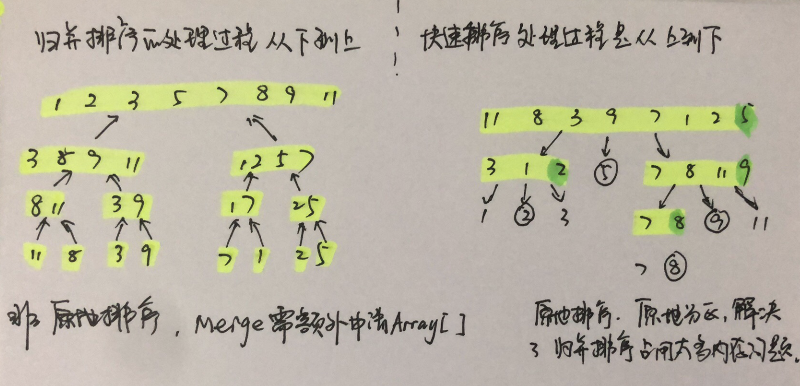
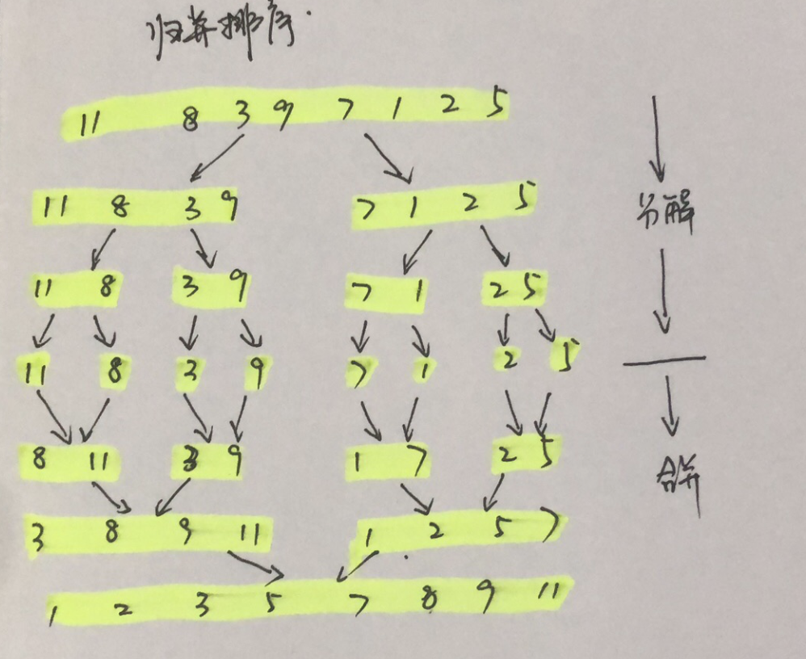

# 排序

依据时间复杂度分类：

| 排序算法 | 时间复杂度 | 是否基于比较 |
| ---------------- | ---------- | ------------ |
| 冒泡、插入、选择 | O(n^2)     | 是           |
| 快速、归并       | O(nlogn)   | 是           |
| 桶、计数、基数   | O(n)       | 否           |


1. [冒泡、插入、选择、希尔](#link1)
2. [归并、快速](#link2)
3. [桶、计数、基数](#link3)


<h2><span id="link1">1. 冒泡、插入、选择、希尔</span></h2>
#### 冒泡排序

冒泡排序只会操作相邻的两个数据。每次冒泡会对相邻的的两个元素进行比较，看是否满足大小关系要求，若不满足，就互换元素。一次冒泡至少让一个元素移动到它应该在的位置，移动 n 次就完成了排序。

* 冒泡排序是原地排序算法，空间复杂度为O(1)
* 稳定的排序算法
* 时间复杂度：最好O(n)、最差O(n^2)、平均O(n^2)

```go
// bubbleSort sort a to a increasing array.
func bubbleSort(a []int) {
	size := len(a)
	if size <= 1 {
		return
	}
	for i := 0; i < size; i++ {
		flag := false  // 提前退出的标志位
		for j := 0; j < size - i - 1; j++ {
			if a[j] > a[j+1] {
				a[j+1], a[j] = a[j], a[j+1]
				flag = true  // 表示有数据交换
			}
		}
		// 若当前冒泡无数据交换，表示数组已排序完成，直接退出
		if !flag {
			break
		}
	}
}
```

#### 插入排序

插入排序通过将数组分为已排序区间和未排序区间的方式。初始的已排序区间中只有一个元素，就是数组的第一个元素。插入排序的核心思想就是取未排序区间的元素，在已排序区间找到合适的插入位置将其插入，并保证已排序区间元素一直有序。重复这个过程，知道未排序区间为空。

Tip: 常为基本有序、或数据规模较小情况下使用。

* 插入排序是原地排序算法，空间复杂度为O(1)
* 稳定的排序算法
* 时间复杂度：最好O(n)、最差O(n^2)、平均O(n^2)

```go
// InsertionSort sort a to a increasing array.
func InsertionSort(a []int) {
	size := len(a)
	if size <= 1 {
		return
	}
	for i := 0; i < size; i++ {
	    // 当前要插入的元素为a[i]
		value := a[i]
		// 已排序区间大小为 i - 1
		j := i - 1
	    // 查找 a[i] 在已排序区间中适合的位置
		for ; j >= 0; j-- {
			if a[j] > value {
				a[j+1] = a[j]  // 数据移动
			} else {
				break
			}
		}
		a[j+1] = value  // 插入数据
	}
}
```

#### 选择排序

选择排序类似插入排序。不同的是，每次选择未排序区间中的最小元素，插入到已排序区间的末尾。

* 插入排序是原地排序算法，空间复杂度为O(1)
* 不稳定的排序算法
* 时间复杂度：最好O(n^2)、最差O(n^2)、平均O(n^2)

```go
// SelectionSort sort a to a increasing array.
func SelectionSort(a []int) {
	size := len(a)
	if size <= 1 {
		return
	}
	for i := 0; i < size; i++ {
		// 查找最小值
		minIdx := i
		for j := i + 1; j < size; j++ {
			if a[j] < a[minIdx] {
				minIdx = j
			}
		}
		// 交换
		a[i], a[minIdx] = a[minIdx],a[i]

	}
}
```

#### 希尔排序

希尔排序（shell sort）是插入排序的改进版本。希尔排序是把记录按下标的一定增量分组，对每组使用直接插入排序。核心思想：将数组按步长 step 进行分组，遍历 step<v<len(a)，对每一组进行排序，排序后得到的数据有序程度提高。然后缩短步长，重新分组，遍历 newstep<v<len(a)，对每一组进行排序。直至 newstep = 1。

* 希尔排序是原地排序算法，空间复杂度为O(1)
* 不稳定的排序算法
* 时间复杂度：最好-根据步长序列的不同而不同、最差O(n^2)、平均O(nlogn)

```go
// ShellSort sort a to a increasing array.
func ShellSort(a []int) {
	size := len(a)
	if size <= 1 {
		return
	}
	// 步长 step ，选择 n/3
	for step := size/3; step > 0; step /= 3 {
		// 遍历 步长 = step 后的所有数据，按 step 进行分组排序
		for i := step; i < size; i++ {
			// 按 step，数组从 j 到 0 进行交换，即 a[i] a[i-step] a[i-step-step] ... 进行比较
			for j:= i - step; j >= 0; j -= step {
				if a[i] < a[j] {
					a[i], a[j] = a[j], a[i]
				} else {
					break
				}
			}
		}
	}
}
```

<h2><span id="link2">2. 归并、快速</span></h2>

归并和快速排序用的都是分治思想，通过递归实现，过程相似。归并排序在于理解递推公式和 merge 函数。同理，快速排序是理解递推公式和 partition 函数

#### 归并排序

归并排序的思想就是先递归分解数组，排序后合并数组。

将数组分解最小之后，然后合并2个有序数组，基本思路就是比较两个数组的最前面的数，
谁小就先取谁，取了之后相应的指针往后移一位。然后再比较，直至一个数组为空，最后把另
一个数组的剩余部分复制过来即可。

* 归并排序不是原地排序算法，空间复杂度为O(n)
* 不稳定的排序算法
* 时间复杂度：最好O(nlogn)、最差O(nlogn)、平均O(nlogn)



```go
// MergeSort sort a to a increasing array.
func MergeSort(a []int) {
	size := len(a)
	if size <= 1 {
		return
	}
	mergeSort(a, 0, size-1)
}

func mergeSort(a []int, start, end int) {
	// 递归终止条件
	if start >= end {
		return
	}

	mid := (start + end) / 2
	// 分治递归
	mergeSort(a, start, mid)
	mergeSort(a, mid + 1, end)
	// 将 a[start...mid] 和 a[mid=1...end] 合并为 a[start...end]
	merge(a, start, mid, end)
}

func merge(a []int, start, mid, end int) {
	tmpArray := make([]int, end-start+1)
	i, j, k := start, mid + 1, 0
	
	for ; i <= mid && j <= end; k++ {
		if a[i] < a[j] {
			tmpArray[k] = a[i]
			i ++
		} else {
			tmpArray[k] = a[j]
			j ++
		}
	}

	// 拷贝剩下的元素
	for ; i <= mid; i++ {
		tmpArray[k] = a[i]
		k++
	}
	for ; j <= end; j++ {
		tmpArray[k] = a[j]
		k++
	}
	copy(a[start:end+1], tmpArray)
}
```

#### 快速排序

快速排序的思想是：选取任一数据为分区点( pivot )，遍历数据，把比 pivot 小的数据放在左边，大的放在右边。一边过后，数组变成3份数据，左区间比pivot小，pivot，右区间比pivot大。
根据分治、递归的思想，分别对左、右区间进行选择 pivot， 排序。直到左右区间缩小为1，即排序完成。

* 归并排序是原地排序算法，空间复杂度为O(1)
* 不稳定的排序算法
* 时间复杂度：最好O(n)、最差O(n^2)、平均O(nlogn)

```go
// QuickSort sort a to a increasing array.
func QuickSort(a []int) {
	size := len(a)
	if size <= 1 {
		return
	}
	separateSort(a, 0, size-1)
}

func separateSort(a []int, start, end int) {
	if start >= end {
		return
	}
	i := partition(a, start, end)
	separateSort(a, start, i-1)
	separateSort(a, i+1, end)
}

func partition(a []int, start, end int) int {
	// 取最后一位当对比数字
	pivot := a[end]

	var i = start
	for j := start; j < end; j++ {
		if a[j] < pivot {
			if i != j {
				a[j], a[i] = a[i], a[j]
			}
			i ++
		}
	}
	a[i], a[end] = a[end], a[i]
	return i
}
```

##### 快速排序优化
选择合理的分区点 pivot
1. 三数取中法 -> 取首、尾、中位数，对比大小，取中间值为分区点
2. 随机法 -> 每次从分区中随机选择一个元素作为分区点

<h2><span id="link3">3. 桶、计数、基数</span></h2>

...

